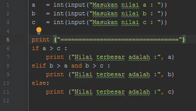

#latihan2

-Ada tiga kondisional di Python, yang dapat anda gunakan untuk membangun alur logika untuk program anda.
 Python memiliki Statement if,if..felse, dan if..elif.else. Berikut ini adalah contoh penggunaan if di Python
